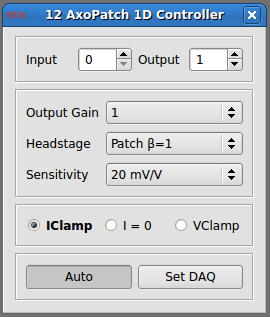

###Axon AxoPatch 1D Controller

**Requirements:** None  
**Limitations:** None  

<!--start-->
Amplifier control module to compensate for scaling properties of the Axon AxoPatch 1D controller. This module essentially acts as an interface that replicated functionality of the control panel, but in a manner specific to the controller's own functionality. 
<!--end-->

**Note:** You will still have to activate the input/output channels via the system control panel.  

####Input Channels
1. input(0) - Gain Telegraph : the telegraph used in Auto mode

####Output Channels
None

####Parameters
1. Input Channel - input channel to scale (#)
2. Output Channel - output channel to scale (#)
3. Headstage Gain - gain set by the headstage
4. Command Sensitivity - sensitivity setting from amplifier (mV/V)
5. Output Gain - output gain from amplifier
6. Amplifier Mode - mode setting on the amplifier (vclamp, iclamp, or i=0)

####States
None
