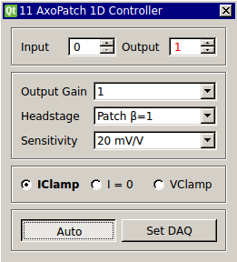

###Axon AxoPatch 1D Controller

**Requirements:** None  
**Limitations:** None  

Amplifier control module to compensate for scaling properties of the Axon AxoPatch 1D controller. This module essentially acts as an interface that replicated functionality of the control panel, but in a manner specific to the controller's own functionality. 

