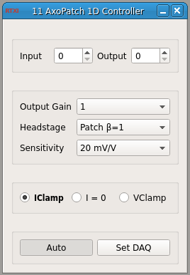

###Axon AxoPatch 1D Controller

**Requirements:** None  
**Limitations:** None  

<!--start-->
Amplifier control module to compensate for scaling properties of the Axon AxoPatch 1D controller. This module essentially acts as an interface that replicated functionality of the control panel, but in a manner specific to the controller's own functionality. 
<!--end-->

**Note:** You will still have to activate the input/output channels via the system control panel.  

####Input Channels
1. input(0) - Gain Telegraph : the telegraph used in Auto mode

####Output Channels
None

####Parameters
1. Input Channel
2. Output Channel 
3. Headstage Gain
4. Command Sensitivity
5. Output Gain
6. Amplifier Mode

####States
None
